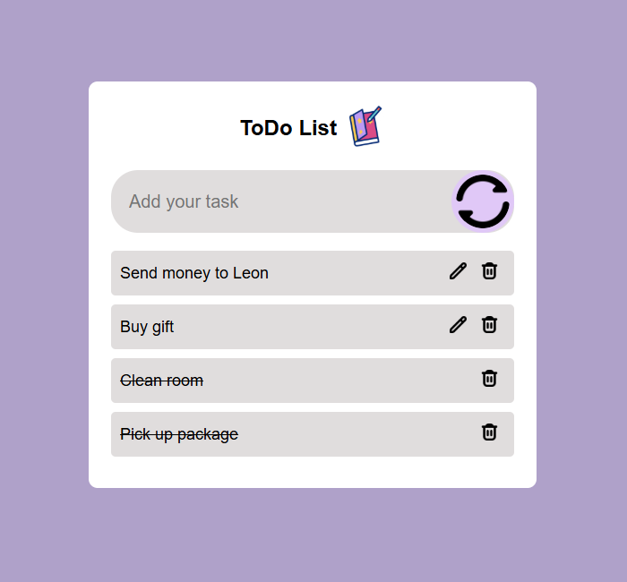

Eine einfache To-Do-Liste-Anwendung, entwickelt mit HTML, CSS und JavaScript.

## Über das Projekt

Ich habe dieses Projekt entwickelt, um meine Kenntnisse in JavaScript, HTML und CSS praktisch anzuwenden und zu vertiefen.

Die Anwendung ermöglicht es, Aufgaben zu erstellen, zu bearbeiten, zu löschen und als erledigt zu markieren. Dabei erweitere ich das Projekt kontinuierlich, lerne neue Konzepte kennen, behebe Fehler und verbessere die Anwendung Schritt für Schritt.

## Funktionen

* Neue Aufgaben hinzufügen
* Bestehende Aufgaben bearbeiten
* Aufgaben löschen
* Aufgaben als erledigt markieren
* Speicherung der Daten mit Local Storage

## Screenshot

  

## Verwendete Technologien

* HTML
* CSS
* JavaScript

## Aktueller Status

Dieses Projekt ist für mich ein laufender Lernprozess. Ich arbeite regelmäßig daran, neue Funktionen einzubauen, bestehende Abläufe zu verbessern und meinen Code zu optimieren. Mit jedem Update lerne ich neue Techniken kennen und sammle weitere praktische Erfahrung in der Webentwicklung.

## Hinweis

## Hinweis

Den Quellcode und die Kommentare habe ich auf Englisch verfasst. So gewöhne ich mich an die Arbeitsweise, die in vielen Projekten und Entwicklungsteams üblich ist.

## Autor

Solongoo Sarangoo
